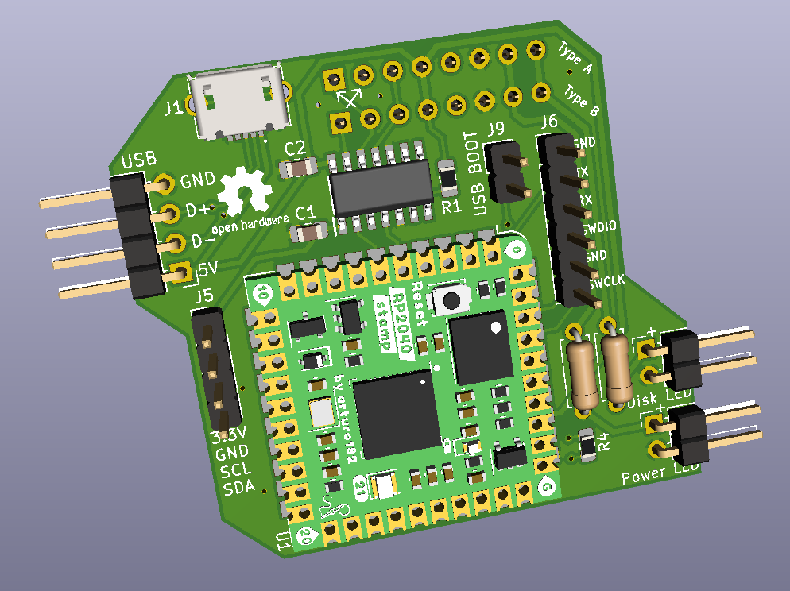

# A500-USB-Keyboard-Adapter-RP2040
A USB keyboard adapter for the Amiga 500 based on the Pi Stamp RP2040

## Intro
This is a USB keyboard adapter I designed a board for to use in my Amiga 500 tower. It is based on the amigahid-pico firmware by borb (nine). The KiCAD files, Gerbers, and BOM are in this repository. The completed board attaches to the A500's keyboard header and provides a USB pin header for your interface device. On my build, I used a pin header to female USB Type A cable that screws into in the rear of my case on a PCI bracket.

Demo Video: https://youtu.be/7yw0AOvhLqg  (Rev 0 board with bodges/resistors. These have been corrected and implemented in Rev 1.)

## Parts
* PCB: I ordered the PCB's from JLCPCB by uploading the Gerber files, but any PCB house should be able to make these since it is a simple/small design. (PCBway, OSH Park, AllPCB, etc.)
* Pi Stamp RP2040: https://shop.pimoroni.com/products/rp2040-stamp
* All other PCB mounted components were sourced at Mouser per the BOM. Other sources for the components could be Digikey, Farnell, RS, etc. depending on what is available in your location. Chip/component shortages may impact your ability to get everything all in one place. Substitutions may need to be made.
* You will need to find a pin header to USB cable that suits your case needs. (Amazon, Ebay, Aliexpress, etc.)

## Building the Adapter
* Solder the smallest SMD components first. (resistors, capacitors, logic level shifter, MicroUSB connector)
* Solder the right angle pin connectors. (USB header, both LED headers)
* Solder the through-hole LED resistors.
* Solder the Pi Stamp RP2040 into place. You can solder directly onto the board, or optionally use the male and female headers to socket mount it. I recommend using the male and female pin headers so you can easily pull the RP2040 out if you need to use it again in the future on another project.
* Solder the vertical USB_BOOT header into place. The J5 and J6 headers are optional and untested on this design. J5 is for a small OLED screen, and J6 is for debugging.
* Solder the A500 keyboard connector female headers onto the rear of the PCB. There are two, since some revisions of A500's may have the clock and data pins swapped.
* I recommend checking all solder joints under magnification to ensure everything is connected with no shorts.

## Flashing the Firmware
First off, a huge thank you to Nine for developing the amigahid-pico, as this design uses its firmware. Firmware is located at: https://github.com/borb/amigahid-pico/
1. Build the firmware per the instructions at https://github.com/borb/amigahid-pico/blob/main/doc/installation.md
2. Place a jumper on the USB_BOOT pin.
3. Plug a MicroUSB cable to the PCB's MicroUSB port and plug the other end into the PC you just compiled the firmware on. It will then show up as a mass storage device.
4. Remove the jumper from the USB_BOOT pin.
5. Copy the amigahid-pico.uf2 file from the "build/src/" directory you compiled to the RP2040's mounted USB storage volume. It will then disconnect/reset.
6. Disconnect the USB cable from the PC and keyboard adapter PCB.

## Installation into the Amiga
1. Gain access to your Amiga 500 motherboard.
2. Disconnect the keyboard if it is still connected.
3. Plug the PCB into the A500's keyboard header either the Type A or Type B socket. For reference my Amiga 500 Rev 6A needed Type A.
4. Plug your USB cable into the pin header. Pay close attention to the orientation of the leads.
5. Plug the keyboard or wireless keyboard adapter into the other end of the USB cable.
6. Boot the Amiga and test it out!

## Optional Stuff
* If using a tower case, you can plug in the Power LED and HDD LED to the pin headers on the PCB to show the status indications.
* USB HID mouse support is included in Nine's firmware, but none of the mice I used would work with it. I use a DB9 connected OpenLaserMouse anyway, but maybe you'll have better luck testing various mice to see if one works. I know the firmware is still an in-progress project, or maybe I didn't do something right when I compiled the firmware. 
* Amiga keys are currently mapped to right and left windows keys. Before compiling the firmware, you can modify those keys if necessary at your own discretion.
* Reset is initiated by Left Ctrl + Left Win + Right Win (CTRL + AMIGA + AMIGA)

## Miscellaneous
This board is provided as-is and open source. It does not provide firmware and relies on a different project as linked above. I have personally built and tested this on my Amiga 500 Rev 6A with a custom mechanical keyboard utilizing QMK/VIA firmware.
If you plan to sell this board, firmware is per the license at: https://github.com/borb/amigahid-pico/
